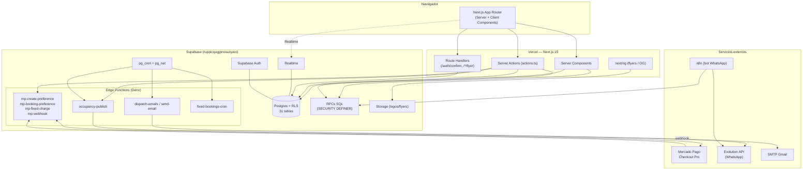
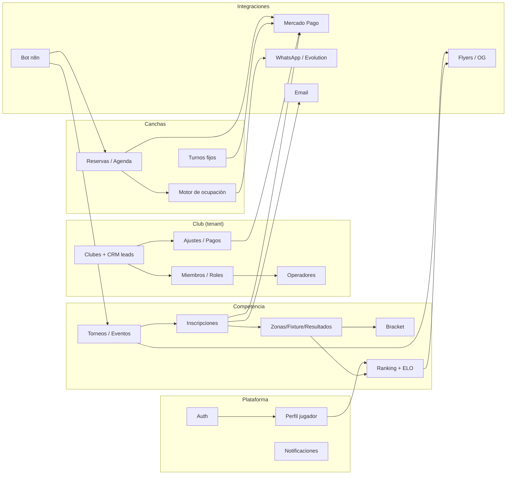

# CURRENT_ARCHITECTURE_FLOW_PADEL.md

> Documentación técnica del **estado actual** del proyecto FlowPadel.
> Alcance: describir lo que existe hoy. No contiene mejoras, refactors ni opiniones.
> Fecha de relevamiento: 2026-07-15.
> Repo relevado: `C:\PadelFlow\FlowPadel-Web` (rama `supabase-refundacion`).
> Proyecto Supabase: `ruppicqugjpnosuxyaoi`.

---

## 1. Arquitectura general

FlowPadel es una plataforma SaaS **multi-tenant** de pádel (clubes, comerciales/operadores y jugadores) construida sobre:

- **Frontend + backend liviano:** una sola app **Next.js 15 (App Router, React 19, TypeScript, Tailwind v4)** desplegada en Vercel (`flow-padel.vercel.app`). Usa **Server Components** + **Server Actions** como capa de backend principal (no hay carpeta `app/api/*` con REST propio).
- **Base de datos + auth + almacenamiento:** **Supabase** (Postgres con RLS, Supabase Auth, Storage, Edge Functions Deno, `pg_cron` + `pg_net`).
- **Pagos:** **Mercado Pago Checkout Pro** (token por club), operado desde **Edge Functions** (`mp-*`) + webhook.
- **Mensajería/flyers:** imágenes OG dinámicas con `next/og` (Satori); WhatsApp saliente vía **Evolution API** disparado por un worker de ocupación (`occupancy-publish`) y por un bot externo en **n8n** (no versionado en este repo).
- **Email:** SMTP (Gmail vía `denomailer`) desde edge functions (`send-email`, `dispatch-emails`); los mails de Auth salen por Supabase Auth con templates propios.

El patrón dominante es: **el navegador habla con Server Components/Server Actions → Supabase (RLS) → y para efectos externos (pago, WhatsApp, email) se invocan Edge Functions**. La seguridad multi-tenant se apoya en **Row Level Security** con `club_id` en las tablas hijas y la tabla `club_members` como núcleo de permisos.

Observación factual: **el repositorio Next.js no versiona las migraciones SQL ni la mayoría de las Edge Functions**. Éstas viven desplegadas en el proyecto Supabase. Sólo `supabase/functions/dispatch-emails/` y `supabase/email-templates/` están en el repo.

---

## 2. Estructura de carpetas

```
FlowPadel-Web/
├── app/                      # App Router (rutas, layouts, server actions, route handlers)
│   ├── (auth)/               # Grupo de rutas de autenticación (login, registro, recupero, reset)
│   ├── admin/                # Panel de gestión (clubes, eventos, agenda, ajustes, etc.)
│   ├── auth/confirm/         # Route handler de verificación OTP de mails
│   ├── event/[slug]/         # Detalle público de evento + opengraph-image
│   ├── pagar/[id]/           # Página de pago de reserva + opengraph-image
│   ├── perfil/               # Perfil del jugador autenticado
│   ├── notificaciones/       # Notificaciones del jugador
│   ├── ranking/              # Ranking público + /ranking/flyer (route handler PNG)
│   ├── register/[slug]/      # Inscripción a evento (form + actions + schema)
│   ├── reservar/             # Reserva pública de canchas + /reservar/[slug]
│   ├── sumarme/[code]/       # Reclamo de cupo de pareja
│   ├── torneos/              # Listado público de torneos + /torneos/flyer (route handler PNG)
│   ├── layout.tsx            # Root layout (tema, header/footer condicional)
│   ├── page.tsx              # Home
│   ├── not-found.tsx
│   └── globals.css
├── components/               # Componentes React (25 client, 11 server/ui)
│   ├── admin/                # Componentes del panel admin
│   └── ui/                   # Primitivas de diseño (button, card, badge, avatar, tabs)
├── lib/                      # Helpers (supabase, admin/permisos, format, utils, flyer-bg, types)
│   ├── supabase/             # Clientes server/client/middleware
│   └── admin/                # Contexto y permisos de club
├── public/
│   └── flyers/               # Fondos JPEG de flyers (torneos, ranking, pago)
├── supabase/
│   ├── email-templates/      # confirm-signup.html, reset-password.html
│   └── functions/
│       └── dispatch-emails/  # (única edge function versionada en el repo)
├── middleware.ts             # Refresco de sesión Supabase + header x-pathname
├── next.config.ts
├── package.json
└── .env.example
```

---

## 3. Módulos y responsabilidades

| Módulo | Responsabilidad | Ubicación principal |
|---|---|---|
| **Auth** | Login/registro/recupero de jugadores y admins; verificación de mails | `app/(auth)/*`, `app/auth/confirm`, `lib/supabase` |
| **Perfil de jugador** | Datos del jugador, notificaciones, preferencias de ofertas, seguimiento | `app/perfil`, `components/profile-form.tsx` |
| **Clubes (tenant)** | ABM de clubes, activación, leads/CRM, superadmin | `app/admin/clubes`, `components/admin/clubes-manager.tsx` |
| **Miembros / roles** | Alta de miembros, cambio de rol, operadores | `app/admin/miembros`, `app/admin/operar` |
| **Torneos / eventos** | Creación, inscripciones, zonas, fixture, resultados, bracket, economía | `app/admin/events/*`, `app/event/[slug]`, `app/register/[slug]` |
| **Ranking** | Ranking de jugadores (ELO) y de clubes | `app/ranking`, `components/*ranking*` |
| **Reservas de cancha** | Reserva pública/admin, agenda, holds, pago | `app/reservar`, `app/admin/agenda` |
| **Turnos fijos** | Turnos mensuales recurrentes + cobros | `app/admin/turnos-fijos` |
| **Motor de ocupación** | Publicación de turnos libres + ofertas last-minute + invitaciones segmentadas (WhatsApp) | `admin/settings` (config), edge `occupancy-publish` |
| **Pagos** | Links de Checkout Pro, webhook, cobros de reserva/torneo/turno fijo | Edge functions `mp-*` |
| **Notificaciones** | Avisos in-app al jugador | `app/notificaciones`, tabla `notifications` |
| **Flyers / OG** | Imágenes dinámicas para compartir | `*/flyer/route.tsx`, `opengraph-image.tsx`, `lib/flyer-bg.ts` |
| **Email** | Avisos de nuevos torneos (cola) + mails de auth | edge `dispatch-emails`/`send-email`, `email-templates/` |
| **Marketplace** | Ver sección 9. | — |

---

## 4. Frontend

- **Framework:** Next.js 15.4.9 (App Router) con React 19.2.1. Turbopack en dev.
- **Estilos:** Tailwind CSS v4 (config-less, vía `@tailwindcss/postcss`), tokens de tema propios (`ink`, `muted`, `surface`, `canvas`, `accent`, `border-*`) con soporte dark/light (script anti-FOUC en `app/layout.tsx`, toggle por `data-theme` + `localStorage flowpadel-theme`).
- **Composición:** predominan Server Components para render inicial; Client Components (`"use client"`) para interacción (formularios, tabs, realtime).
- **Estado:** sin librería de estado global; se usan hooks nativos de React (`useState`, `useTransition`, `useActionState`, `useMemo`, `useRef`), `react-hook-form` + `zod` para formularios, y **Supabase Realtime** para refrescar datos (ej. grilla de eventos, gestión de evento).
- **Primitivas UI:** `components/ui/*` (`button` con `cva`, `card`, `badge`, `avatar`, `tabs`).
- **Iconos:** `lucide-react`.
- **No existen** React Context/Provider propios ni hooks personalizados (`use*`); el "contexto de club" es lógica de dominio en `lib/admin/club.ts` (cookie + consulta), no un React Context.

---

## 5. Backend

El backend está distribuido en tres capas:

1. **Server Actions (Next.js)** — capa principal de mutaciones. Archivos `actions.ts` por ruta (ver Code Index). Ejecutan validación Zod, chequeos de permisos (`requireClubAccess`) y operan contra Supabase con el cliente server-side (respetando RLS). Para efectos externos, invocan Edge Functions.
2. **Supabase Postgres + RPCs** — lógica de dominio en funciones SQL (`SECURITY DEFINER` en varios casos): generación de zonas/fixtures/brackets, standings, ELO, holds de reserva, permisos (`is_club_member`, `is_club_admin`, `is_superadmin`), CRM de leads, etc. Invocadas vía `supabase.rpc(...)`.
3. **Edge Functions (Deno)** — efectos e integraciones. Desplegadas en el proyecto Supabase (ver sección 14). Disparadas por Server Actions o por `pg_cron`/`pg_net`.

No hay servidor Node/Express independiente ni REST propio en `app/api`. Los únicos **route handlers** de Next son generadores de imagen (`/torneos/flyer`, `/ranking/flyer`) y el callback de auth (`/auth/confirm`).

---

## 6. Base de datos

Postgres (Supabase), esquema `public`, **31 tablas base**. RLS habilitado; `club_members` es el núcleo de permisos y `club_id` en tablas hijas segmenta por tenant.

| Tabla | Cols | Propósito (comment de la tabla, cuando existe) |
|---|---|---|
| `profiles` | 8 | Persona con auth. `global_role` = alcance plataforma; rol por club en `club_members`. |
| `clubs` | 14 | Raíz de tenant. Cada club es un tenant aislado; `club_id` en hijas maneja RLS. |
| `club_members` | 6 | Membresía M:N con rol. Núcleo de RLS. |
| `club_leads` | 7 | CRM: clubes nombrados por jugadores aún no en la plataforma (menciones). |
| `club_operator_requests` | 7 | Solicitudes de comercial para operar un club. |
| `club_payment_settings` | 8 | Config de cobro por club (token MP, política de cobro de reservas). |
| `club_occupancy` | 11 | Config del motor de ocupación (grupo WA, descuentos, ventana, segmentación). |
| `players` | 26 | Jugador global de la comunidad; ELO y estadísticas agregadas. |
| `player_standings` | 11 | Ranking individual por jugador dentro de un evento. |
| `player_offer_invites` | 6 | Log de invitaciones de oferta enviadas (dedupe diario). |
| `courts` | 17 | Cancha física para agenda. |
| `court_bookings` | 23 | Reservas/bloqueos de cancha (estado, pago, hold, cliente). |
| `court_offers` | 8 | Ofertas last-minute activas por turno (con vencimiento). |
| `fixed_bookings` | 14 | Turnos fijos mensuales recurrentes. |
| `fixed_booking_charges` | 12 | Cobros por periodo de los turnos fijos. |
| `events` | 35 | Torneo o juego abierto. Scope por tenant (`club_id`). |
| `categories` | 6 | Niveles/divisiones de juego por club. |
| `registrations` | 21 | Solicitud de inscripción (insert público / aprobación admin). |
| `teams` | 12 | Pareja competidora dentro de un evento. |
| `zones` | 8 | Grupo de fase de grupos. |
| `zone_teams` | 2 | Membresía de equipos en zonas. |
| `standings` | 14 | Tabla de posiciones de fase de grupos (materializada). |
| `matches` | 21 | Partido único, transversal a todas las fases. |
| `brackets` | 7 | Árbol de eliminación de un evento. |
| `rounds` | 7 | Jornada (fecha) de una liga larga. |
| `elo_history` | 7 | Ledger append-only de ELO; una fila por jugador por partido rankeado. |
| `payments` | 15 | Cargo de inscripción. Agnóstico de proveedor. |
| `mp_payments` | 13 | Pagos de Mercado Pago (preference/payment ids). |
| `notifications` | 9 | Avisos in-app del jugador. |
| `tournament_invites` | 8 | Cola de invitaciones (email/otros canales) a nuevos torneos. |
| `bot_sessions` | 4 | Estado de sesión del bot de WhatsApp (máquina de estados). |

Funciones SQL/RPC clave referenciadas por el código (no exhaustivo): `public_booking_clubs`, `public_court_day`, `create_public_hold`, `public_booking_payinfo`, `club_ranking`, `event_approved_count`, `registration_phone_taken`, `upsert_club_lead`, `find_player_by_phone`, `add_club_member`, `admin_create_club`, `admin_delete_club`, `accept_interclub`, `operator_request_club`, `operator_decide`, `generate_division_zones`, `generate_americano`, `generate_league`, `generate_bracket`, `submit_match_result`, `eligible_offer_players`, `is_club_member`, `is_club_admin`, `is_superadmin`.

---

## 7. Autenticación

- **Proveedor:** Supabase Auth (email + contraseña).
- **Sesión:** cookies gestionadas por `@supabase/ssr`. `middleware.ts` → `updateSession` refresca la sesión en cada request y publica `x-pathname`.
- **Flujos:** login/registro (`app/(auth)/actions.ts`: `loginAction`, `signupAction`, `logoutAction`), recupero (`requestPasswordReset` + `resetPasswordForEmail`) y reset (`updatePasswordAction`). El callback `app/auth/confirm/route.ts` (`GET`) valida `token_hash`/`type` con `verifyOtp` para confirmación de cuenta y recupero.
- **Templates de mail de Auth:** `supabase/email-templates/confirm-signup.html` y `reset-password.html` (branding FlowPadel).
- **Redirección post-login:** si el usuario es `club_member` → `/admin`; si no → `/` (o `/perfil?welcome=1` tras signup).
- **Anti-enumeración:** el recupero siempre responde ok sin revelar si el email existe.

---

## 8. Roles

Dos niveles de rol:

1. **Plataforma** (`profiles.global_role`): incluye **superadmin** (acceso a `/admin/clubes`, ABM de clubes).
2. **Por club** (`club_members.role`): valores observados en la UI/DB — `club_admin`, `staff`, `operator` (comercial que opera canchas/torneos de otros clubes, con permisos acotados; **no** finanzas/miembros/MP). El enum de rol se amplió con `operator`.

- **Contexto activo:** `lib/admin/club.ts` resuelve membresías y "club activo" por cookie (`padel_active_club` / `ACTIVE_CLUB_COOKIE`); `getAdminContext()` para páginas y `requireClubAccess()` para server actions.
- **Gating de UI:** `components/admin/sidebar-nav.tsx` filtra items por rol (`adminOnly`, `superadminOnly`). Páginas sensibles (miembros, clubes, proyección) verifican rol server-side.
- **Modelo operador:** solicitud (`operator_request_club`) → aprobación del club (`operator_decide`) → alta en `club_members` con `role='operator'`. Un login puede operar múltiples clubes vía el `ClubSwitcher`.

---

## 9. Marketplace

**No existe un módulo "Marketplace" implementado** como tal en el código actual (no hay rutas, componentes ni tablas con ese nombre o función de mercado/transacciones entre terceros/catálogo de productos).

Lo más cercano conceptualmente son piezas de descubrimiento y captación:
- **Directorio público de clubes** para reservar (`/reservar`).
- **Listados públicos** de torneos (`/torneos`) y ranking (`/ranking`).
- **CRM de leads** (`club_leads`, `/admin/prospectos`): clubes nombrados por jugadores que aún no están en la plataforma, con conteo de menciones (mecanismo de expansión/captación).

Estado del módulo Marketplace: **No iniciado**.

---

## 10. Clubes

- **Tenant raíz** (`clubs`, 14 columnas: nombre, ciudad, dirección, teléfono, contacto, descripción, instagram, website, logo, etc.).
- **ABM:** `/admin/clubes` (solo superadmin) con `ClubesManager` — crear (`admin_create_club`), activar/archivar (`setClubActive`), eliminar (`admin_delete_club`, bloqueado si tiene eventos o reservas).
- **Datos y config:** `/admin/settings` (`club_admin`/superadmin) — datos del club, canchas, Mercado Pago, política de cobro de reservas, motor de ocupación.
- **CRM/leads:** clubes-lead creados al mencionarlos jugadores (`upsert_club_lead`), visibles en `/admin/prospectos` y `/admin/clubes`.
- **Multi-club:** un usuario con varias membresías cambia de club activo con `ClubSwitcher` (`setActiveClub`).

---

## 11. Jugadores

- **Entidad global** (`players`, 26 columnas): nombre, teléfono, email, club de origen, ELO, partidos jugados/ganados, categoría, género, mano, foto, flags de notificación (`notify_inapp/email/whatsapp/telegram`), `receive_offers`, vínculo a `club_lead`.
- **Perfil autenticado:** `/perfil` (`ProfileForm`) asegura fila `players` vinculada al `profile`, edita datos y muestra "Mi seguimiento" (standings por torneo, ELO global, puntos aportados al club).
- **Directorio admin:** `/admin/players` (top 200 por ELO, búsqueda por nombre).
- **Ranking:** `/ranking` (top 50 por ELO) y home (top 6).
- **Deduplicación por teléfono:** al crear turnos fijos/reservas se busca/matchea el jugador por teléfono (`find_player_by_phone`, `registration_phone_taken`).
- **Consentimiento de ofertas:** `receive_offers` + `notify_whatsapp` gobiernan el canal segmentado del motor de ocupación.

---

## 12. Torneos

Módulo más extenso. Entidad `events` (35 columnas) con `event_type` (`tournament` / juego abierto), estados (`draft/open/in_progress/...`), modalidad (caballeros/damas/mixto), categoría (fija o por suma), fechas, precio, `flyer_image_url`, `long_format` (liga larga), config económica, e interclub (club rival).

Flujo:
1. **Creación** (`createEvent`) — borrador con slug único; soporta interclub.
2. **Inscripción pública** (`/register/[slug]` → `submitRegistration`) — validación de pareja/modalidad/categoría, chequeo de cupo y de teléfono duplicado, código de reclamo de compañero (`/sumarme/[code]`).
3. **Gestión** (`/admin/events/[id]` → `EventManager`) — aprobar/rechazar/waitlist inscripciones, generar equipos, cobrar seña/inscripción (`mp-create-preference`).
4. **Competencia** — generar zonas (`generate_division_zones`), iniciar torneo (round-robin), cargar resultados (`recordMatchResult`/`recordLeagueResult`), recalcular standings + ranking individual + ELO (`submit_match_result`, `elo_history`), auto-sembrar/avanzar bracket (`generate_bracket` + trigger de avance).
5. **Formatos** — fase de grupos + eliminación; liga larga (`rounds`, `player_standings`); americano (`generate_americano`).
6. **Economía** — `saveEventEconomics` (costo de cancha, matches por cancha, markup, inscripción por persona); proyección en `/admin/proyeccion`.
7. **Bloqueo de canchas** — `blockTournamentCourts`/`unblockTournamentCourts` en la franja del torneo respetando reservas.
8. **Difusión** — flyer OG (`/event/[slug]/opengraph-image.tsx`, `/torneos/flyer`), avisos por email (cola `tournament_invites`).

Estado: **Terminado/Parcial** según submódulo (ver sección 16).

---

## 13. Reservas

- **Canchas** (`courts`, 17 columnas): superficie, tipo de cerramiento, cubierta, luz, panorámica, precio por turno, minutos por turno, días/horarios de operación, número autoasignado.
- **Reserva pública** (`/reservar` → `/reservar/[slug]`): lista de clubes (`public_booking_clubs`), grilla de turnos del día (`public_court_day`), reserva sin login con CRM por teléfono. `createPublicBooking` crea un **hold de 30 min** (`create_public_hold`); si el club cobra en el club, confirma directo; si no, genera link de Mercado Pago (`mp-booking-preference`).
- **Reserva/agenda admin** (`/admin/agenda` → `AgendaView`/`agenda-grid`): crear reserva o bloqueo, reserva con pago (`createBookingWithPayment`), generar link para reserva existente, cancelar. Estados de turno: libre / reservada / **en proceso** (held) / bloqueada.
- **Pago** (`/pagar/[id]`): redirige a Checkout Pro si sigue en `held`, muestra confirmado/expirado según estado (`public_booking_payinfo`).
- **Turnos fijos** (`/admin/turnos-fijos`): recurrentes mensuales, vinculan jugador por teléfono, generan cobro por periodo (`mp-fixed-charge`), renovación/cron (`fixed-bookings-cron`).
- **Motor de ocupación** (config en `/admin/settings`, ejecución en edge `occupancy-publish` por `pg_cron`): publica turnos libres al grupo de WhatsApp del club, aplica descuentos last-minute (`court_offers`) e invita a jugadores segmentados (fieles/dormidos) respetando consentimiento (`player_offer_invites`).

---

## 14. Integraciones

| Integración | Uso actual | Piezas |
|---|---|---|
| **Supabase** | DB, Auth, Storage, Realtime, Edge Functions, cron | `lib/supabase/*`, RPCs, edge functions |
| **Mercado Pago (Checkout Pro)** | Cobro de inscripciones de torneo, reservas y turnos fijos; token por club | Edge: `mp-create-preference`, `mp-booking-preference`, `mp-fixed-charge`, `mp-webhook`; config en `club_payment_settings` / `updateClubPayments`; tablas `payments`, `mp_payments` |
| **Evolution API (WhatsApp)** | Salida de mensajes: publicación de ocupación + invitaciones + (bot) | Edge `occupancy-publish` (POST a `/message/sendText`); config `club_occupancy` |
| **n8n** | Bot de WhatsApp (menú Reservar/Torneos/Ranking/Perfil) — **externo, no versionado en el repo**; consume RPCs y tabla `bot_sessions` | Workflow en n8n cloud (Terabound) |
| **next/og (Satori)** | Flyers e imágenes OG para compartir | `*/flyer/route.tsx`, `opengraph-image.tsx`, `lib/flyer-bg.ts`, `public/flyers/*.jpg` |
| **Email (SMTP Gmail / denomailer)** | Avisos de nuevos torneos (cola `tournament_invites`) y utilitario | Edge `dispatch-emails`, `send-email` |
| **Supabase Auth mail** | Confirmación de cuenta y recupero | `email-templates/*` |

**Edge Functions desplegadas (proyecto Supabase, 8):**
`dispatch-emails` (v4), `mp-create-preference` (v1), `mp-webhook` (v4), `mp-booking-preference` (v3), `mp-fixed-charge` (v1), `send-email` (v1), `fixed-bookings-cron` (v1), `occupancy-publish` (v2). Sólo `dispatch-emails` está versionada en el repo.

Integraciones **sin** presencia activa en código: Telegram (solo flag de preferencia), Stripe/transfer/cash (existen como valores de enum `payment_provider` pero el flujo activo es Mercado Pago).

---

## 15. Variables de entorno (sin secretos)

**App Next.js (`process.env`):**
- `NEXT_PUBLIC_SUPABASE_URL`
- `NEXT_PUBLIC_SUPABASE_ANON_KEY`

`.env.example` sólo declara esas dos. `next.config.ts` fija `images.remotePatterns` para `ruppicqugjpnosuxyaoi.supabase.co/storage/v1/object/public/**`.

**Edge Functions (`Deno.env.get`):**
- `SUPABASE_URL`
- `SUPABASE_SERVICE_ROLE_KEY`
- `APP_PUBLIC_URL`
- `GMAIL_USER`
- `GMAIL_APP_PASSWORD`
- `EMAIL_BATCH`

**Credenciales que NO son env vars** (guardadas en DB vía server actions): Access Token/Public Key de Mercado Pago por club (`club_payment_settings`) y config de WhatsApp/ocupación (`club_occupancy`). La app usa la **anon key** de Supabase (pública por diseño). En `occupancy-publish` la URL/API-key de Evolution están **hardcodeadas** en el código de la función.

---

## 16. Estado de cada módulo

| Módulo | Estado | Nota factual |
|---|---|---|
| Auth (login/registro/recupero/reset/confirm) | **Terminado** | Flujos completos + templates de mail. |
| Perfil de jugador | **Terminado** | Edición + seguimiento. |
| Clubes (ABM + CRM leads) | **Terminado** | Superadmin ABM; leads por menciones. |
| Miembros / roles | **Terminado** | club_admin/staff/operator. |
| Modelo operador (comercial multi-club) | **Terminado** | Solicitud + aprobación + permisos acotados. |
| Torneos — creación/inscripción | **Terminado** | Público + manual + reclamo de pareja. |
| Torneos — zonas/fixture/resultados/standings/ELO | **Terminado** | Round-robin, liga larga, americano. |
| Torneos — bracket (auto-seed + auto-advance) | **Terminado** | Trigger de avance. |
| Torneos — economía/proyección | **Parcial** | Config y proyección presentes. |
| Ranking (jugadores + clubes) | **Terminado** | ELO + ranking de clubes. |
| Reservas públicas + agenda + pago | **Terminado** | Hold 30 min + pay-at-club + MP. |
| Turnos fijos + cobros | **Terminado** | Recurrencia + cron. |
| Motor de ocupación (grupo + segmentado) | **Terminado (recién incorporado)** | Config UI + edge + cron; requiere JID de grupo por club. |
| Pagos (Mercado Pago) | **Terminado** | Preferencias + webhook + cobros. |
| Notificaciones in-app | **Terminado** | Lista + marcar leído. |
| Email (avisos de torneos) | **Parcial / dormido** | `dispatch-emails` requiere secrets + cron para activarse. |
| Bot WhatsApp (n8n + Evolution) | **Parcial (externo)** | Menú operativo; no versionado en el repo. |
| Flyers / OG dinámicos | **Terminado** | Torneos, ranking, pago, evento. |
| Marketplace | **No iniciado** | No existe módulo. |

---

## 17. Deuda técnica y problemas detectados (sin soluciones)

Observaciones factuales, sin recomendaciones:

1. **Backend disperso entre tres capas** (Server Actions + RPCs SQL + Edge Functions) sin una única fuente de verdad de contratos.
2. **Migraciones no versionadas en el repo:** el esquema Postgres y la mayoría de RPCs no están bajo control de versiones junto al código; sólo se reflejan en `lib/database.types.ts` (generado).
3. **Edge Functions no versionadas:** 7 de 8 funciones desplegadas no están en el repo; sólo `dispatch-emails`.
4. **Credenciales hardcodeadas** en `occupancy-publish` (URL y API-key de Evolution en el código de la función).
5. **`eslint.ignoreDuringBuilds: true`** en `next.config.ts`: los errores de lint no bloquean el build (se agregó tras un incidente en que un error de lint frenó todos los deploys).
6. **Uso de `<a>` con `eslint-disable`** en enlaces cross-boundary (header/layout) para forzar full reload y evitar un bug de re-render de layout.
7. **`export const dynamic = "force-dynamic"`** generalizado: la mayoría de páginas se renderizan siempre en runtime (sin caché estática).
8. **Sin capa de servicios ni tipos de dominio compartidos** entre Server Actions y Edge Functions: la lógica de pagos/mensajería vive en múltiples `actions.ts` y en funciones Deno separadas.
9. **Un solo bot/instancia Evolution compartido** con otro proyecto (Terabound), con API-key común (riesgo de acoplamiento operativo).
10. **Email de torneos "dormido":** funcional en código pero no activado (faltan secrets/cron), lo que deja el canal email inactivo.
11. **Ausencia de tests** automatizados en el repo (no se detectaron archivos de test).
12. **Realtime como mecanismo de refresco** en varias vistas (acopla la UI a suscripciones Supabase para consistencia).

---

## 18. Flujo completo de navegación

**Visitante (sin login):**
`/` (home: eventos + ranking) → `/torneos` (listado) → `/event/[slug]` (detalle) → `/register/[slug]` (inscripción) → link de pago MP / `/sumarme/[code]` (reclamo de pareja).
En paralelo: `/reservar` → `/reservar/[slug]` (turnos del día) → reserva → `/pagar/[id]` (pago) o confirmación pay-at-club.
Ranking público: `/ranking`.

**Jugador autenticado:**
`/login` → (según rol) `/` o `/admin`. Rutas de jugador: `/perfil` (datos + seguimiento), `/notificaciones`.

**Admin/staff/operator:**
`/login` → `/admin` (dashboard). Panel: `/admin/events` (+ `/admin/events/[id]`), `/admin/agenda`, `/admin/turnos-fijos`, `/admin/calendario`, `/admin/players`, `/admin/prospectos`, `/admin/proyeccion`, `/admin/settings`, `/admin/miembros` (solo club_admin), `/admin/operar`. `ClubSwitcher` cambia el club activo.

**Superadmin:** además `/admin/clubes` (ABM de clubes).

**Callbacks/asíncronos:** `/auth/confirm` (verificación de mail), webhook de Mercado Pago (`mp-webhook`), crons (`fixed-bookings-cron`, `occupancy-publish`, cola de emails).

---

## 19. Diagrama Mermaid de arquitectura



---

## 20. Diagrama Mermaid de módulos



---

## 21. Resumen ejecutivo

FlowPadel es un **SaaS multi-tenant de pádel** implementado como una **única aplicación Next.js 15 (App Router)** sobre **Supabase** (Postgres+RLS, Auth, Storage, Edge Functions, cron). La lógica de negocio se reparte entre **Server Actions** (mutaciones y orquestación), **RPCs SQL** (dominio: torneos, standings, ELO, holds, permisos) y **Edge Functions Deno** (pagos con Mercado Pago, WhatsApp vía Evolution, emails, crons).

Los dominios funcionales **operativos y completos** son: autenticación, perfil de jugador, clubes y CRM de leads, miembros/roles (incluido el modelo de operador multi-club), torneos de punta a punta (inscripción → zonas/fixture → resultados → standings/ELO → bracket), ranking, reservas de cancha (públicas y de agenda, con pago o pago en el club), turnos fijos con cobro recurrente, notificaciones in-app, flyers/OG dinámicos y el motor de ocupación de WhatsApp (publicación + ofertas + invitaciones segmentadas). El **bot de WhatsApp** funciona pero vive en **n8n externo**; el **canal de email** está implementado pero **dormido**. **No existe un módulo de Marketplace**.

La principal característica estructural a tener en cuenta para una futura reingeniería es que **el esquema de base de datos, los RPCs y 7 de las 8 Edge Functions no están versionados en el repositorio Next.js**: viven desplegados en el proyecto Supabase. El repo versiona la app web, los templates de mail de Auth y una sola Edge Function (`dispatch-emails`). La multi-tenencia se sostiene con RLS y `club_members`, y el estado de tenant activo con cookie.

Este documento es la **línea base del estado actual** para la reingeniería; el inventario detallado está en `FLOW_PADEL_CODE_INDEX.md`.
